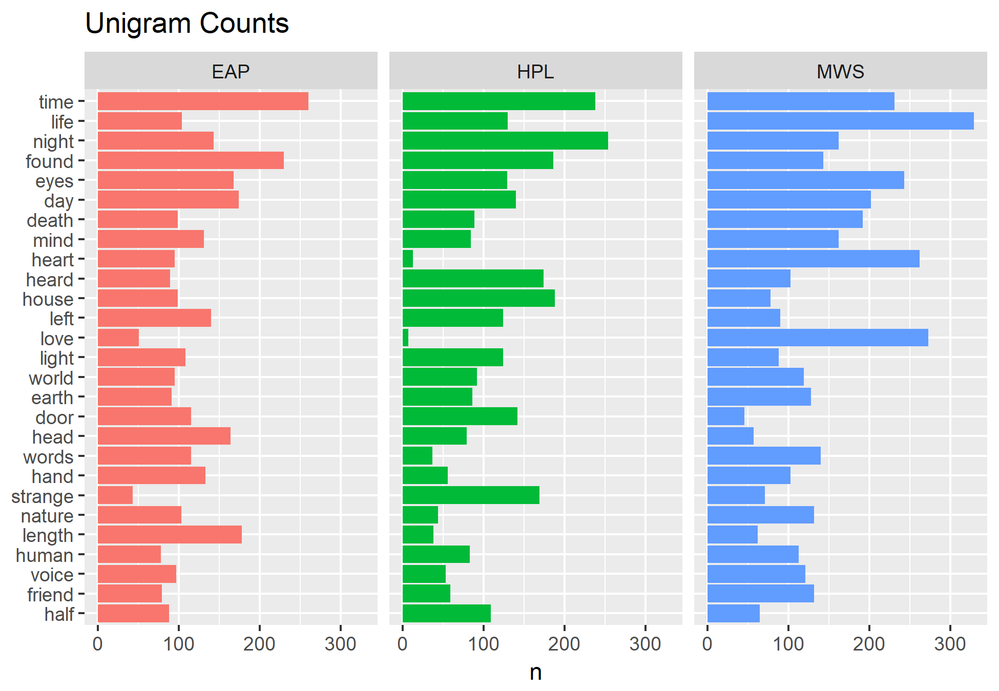

# Spring2018
# Project 1:

----
edit readme

### [Project Description](doc/)
This is the first and only *individual* (as opposed to *team*) this semester. 

Term: Spring 2018

+ Project title: Spooky Analysis
+ This project is conducted by Alek Anichowski
+ Project summary: In this project we analyze sentences from Edgar Allen Poe (EAP) H.P. Lovecraft (HPL) and Mary Shelley (MWS)

Following [suggestions](http://nicercode.github.io/blog/2013-04-05-projects/) by [RICH FITZJOHN](http://nicercode.github.io/about/#Team) (@richfitz). This folder is organized as follows.

```
proj/
├── lib/
├── data/
├── doc/
├── figs/
└── output/
```

Please see each subfolder for a README file.

## Word analysis

In this section we look at the words each author uses to distinguish some common phrases that may differentiate them.

In the first figure, we look at individual words by themselves, with no context.



We see that  "time", "life", "night" and "eyes" are common to the 3 authors. MWS uses "love" a lot, and HPL uses "strange". 

