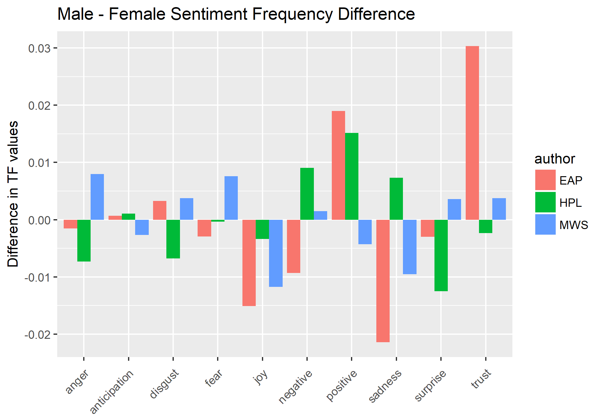
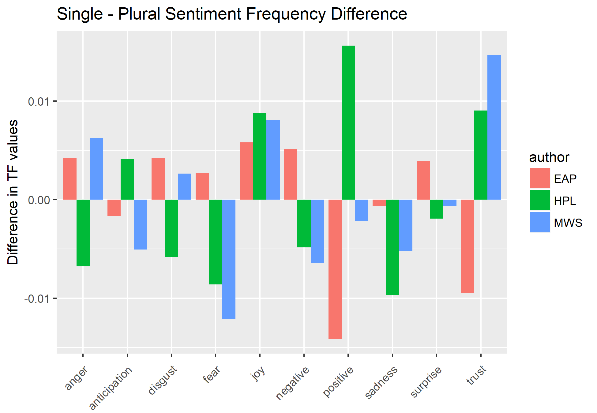
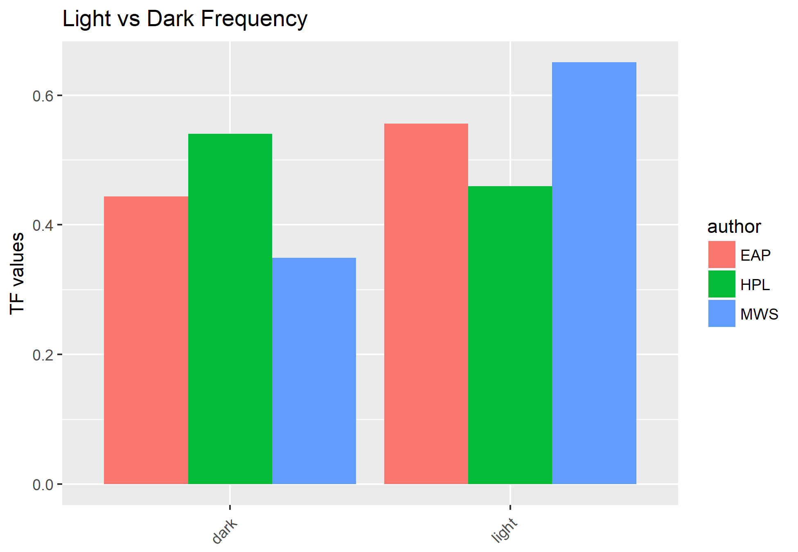
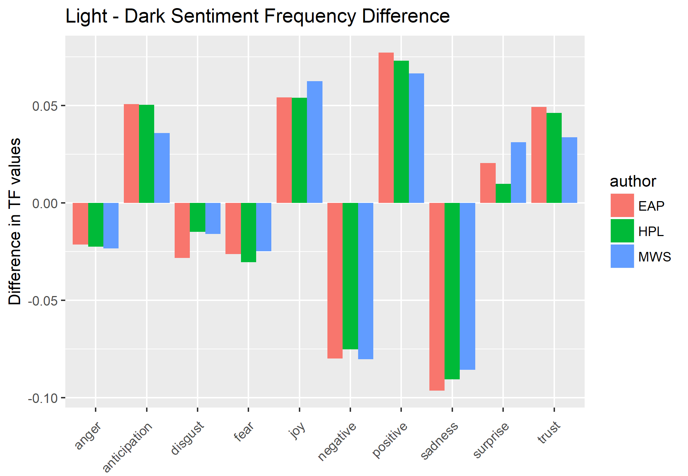

# Spring2018
# Project 1:

----
edit readme

### [Project Description](doc/)
This is the first and only *individual* (as opposed to *team*) this semester. 

Term: Spring 2018

+ Project title: Spooky Analysis
+ This project is conducted by Alek Anichowski
+ Project summary: In this project we analyze sentences from Edgar Allen Poe (EAP) H.P. Lovecraft (HPL) and Mary Shelley (MWS)

Following [suggestions](http://nicercode.github.io/blog/2013-04-05-projects/) by [RICH FITZJOHN](http://nicercode.github.io/about/#Team) (@richfitz). This folder is organized as follows.

```
proj/
├── lib/
├── data/
├── doc/
├── figs/
└── output/
```

Please see each subfolder for a README file.

### Word analysis

In this section we look at the words each author uses to distinguish some common phrases that may differentiate them.

In the first figure, we look at individual words by themselves, with no context.


We see that  "time", "life", "night" and "eyes" are common to the 3 authors. MWS uses "love" a lot, and HPL uses "strange". 

### Bigrams

Now let's take a look at the bigram counts (sets of two words).


Unlike the unigrams, there seem to be a lot less overlap between the authors and the bigrams they use - "short time" being a noteworthy one, maybe used to create a sense of urgency in all the texts. 

The most common bigrams are usually only used by 1 author. We can look at the TF-IDF frequencies to get a better idea of which bigrams are specific to the authors.


A few trends differentiate the authors:
  + Names like "lord raymond" or "madame lalande" or "dr armitage" are usually specific to only 1 author. 
  + EAP and HPL are both fond of laughter, but they write it differently "ha ha" vs. "heh heh".
  + MWS deals with nature/animalistic themes - "fellow creatures", "native country" and "natural philosophy" are frequent .
  + On the other hand, EAP likes material things - "chess players", "main compartment", and "tea pot".
  + HPL describes locations a lot, like "shunned house", "ancient house", or "tempest mountain".
  
### Trigrams

We can do the same with trigrams. It seems that only EAP and HPL have trigrams that they like to repeat, at least in this dataset - MWS doesn't have any specific trigrams she reuses. Again we look at the top frequencies.


  - The most common trigrams are names, specific to each author, like "charles le sorcier" or "moreland clapham lee".
  - EAP still likes chess players, in fact they are usually "automaton chess players".
  - We see laughter again, still differentiated by spelling "ha ha ha" vs "heh heh heh". HPL's "heh" sounds more snide.
  
## Men are from Mars, Women are from Venus

The gender of pronouns can also differentiates the authors. We can first look at the frequencies of gendered pronouns themselves.


MWS uses far more female words than the other two(around 0.4 female vs 0.6 male). EAP is more male skewed, while HPL has a large bias towards using male characters.

We can also look at the words in the sentences that mention men or women, to see which are associated with which. The wordclouds show the comparison

Male Wordcloud:


Female Wordcloud:


Across all the authors, eyes, time and life are common to both, but male sentences feature the "night" while female sentences are more heavily associated with "love", "heart","beauty". Male sentences also seem to have structures in them, like "house" and "city"

Diving further into the treatment of the genders, we can look at the sentiments that surround each mention of a gendered pronoun.

Here we isolate the sentences that mention male or females, then do sentiment analysis on the words in that sentence. Interestingly, since there are less female sentences overall(1837 female vs 5176 male), the 525 shared sentences(with both men and women in them) constitute a larger percentage of the female sentences. 28% of the female sentences also had men in them, while only 10% of the male sentences had women, meaning the females are mentioned along with men with higher frequency than men were mentioned with women. 

The graph shows the frequency of sentiments across the authors, specifically the difference between the male frequency and female frequency of a certain sentiment. A positive difference means that the male sentences were more associated with this sentiment, and negative female sentences. A few trends emerge:



More significant differences:
  +EAP trusts men more than women, this seems to be a major trait of his sentiments towards men.
  +EAP and MWS associate joy and sadness with women more than men, so they are more emotional in the corpus.
  +EAP's men are more positive, while the women more negative - the other author's don't have this difference between gendered pos and neg.
  +MWS's treatment of the genders is fairly balanced
  
Less significant differences:
  +Only in HPL are men more sad than women-in EAP and MWS sadness is associated with women more.
  +HPL's women are also more suprised, angry and disgusted than the men.

## Introverts vs Extroverts

Next we look at the treatment of singular and plural pronouns, in another frequency graph.


Looking at singular vs plural pronouns, we see that all authors use the singular more than the plural, at almost the same rate in fact. MWS does tend to use the singular a bit more (80/20 split instead of 70/30 like EAP and HPL)

Like with gender, we can take sentences that exclusively use single or plural pronouns and analyze the difference in frequency of various sentiments in those sentences.



  -In EAP the plural sentences are more positive than the single, but for HPL it's reversed, single is more positive than plural.
  -EAP trusts groups more, wheras HPL and MWS trust the individual.
  -HPL and MWS associate fear with the plural more than the single pronoun.
  
## No shadows without light

MWS and EAP use more light than dark imagery, and with MWS the difference is the greatest. HPL on the other hand uses more dark imagery in his works.



Looking at the wordclouds again, we see that light and dark actually have many shared associated words.

Light Wordcloud:


Female Wordcloud:


Not suprisingly, the most dominant word in light sentences are "light", and for dark sentences "dark" and "black", since this was how we separated the sentences, but it's comforting to know the rest of the sentence is usually consistent. Often the words of the other kind are included with each other - "darkness" and "dark" in the light wordcloud and "day" or "light"in the dark wordcloud.

When comparing light/dark sentiments, we pretty much get exactly what we hope for in terms of sentiment association, but there doesn't seem to be much differentiation between the authors.



  -anticipation, joy and positivity are associated with light.
  -negative and sadness are associated with dark.
  -EAP and MWS pair suprise with light, while HPL is unbiased
  -EAP has more disgust in his dark imagery


