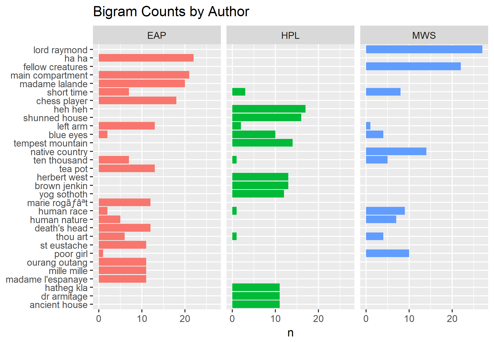

# Spring2018
# Project 1:

----
edit readme

### [Project Description](doc/)
This is the first and only *individual* (as opposed to *team*) this semester. 

Term: Spring 2018

+ Project title: Spooky Analysis
+ This project is conducted by Alek Anichowski
+ Project summary: In this project we analyze sentences from Edgar Allen Poe (EAP) H.P. Lovecraft (HPL) and Mary Shelley (MWS)

Following [suggestions](http://nicercode.github.io/blog/2013-04-05-projects/) by [RICH FITZJOHN](http://nicercode.github.io/about/#Team) (@richfitz). This folder is organized as follows.

```
proj/
├── lib/
├── data/
├── doc/
├── figs/
└── output/
```

Please see each subfolder for a README file.

## Word analysis

In this section we look at the words each author uses to distinguish some common phrases that may differentiate them.

In the first figure, we look at individual words by themselves, with no context.


We see that  "time", "life", "night" and "eyes" are common to the 3 authors. MWS uses "love" a lot, and HPL uses "strange". 

## Bigrams

Now let's take a look at the bigram counts (sets of two words).



Unlike the unigrams, there seem to be a lot less overlap between the authors and the bigrams they use - "short time" being a noteworthy one, maybe used to create a sense of urgency in all the texts. 

The most common bigrams are usually only used by 1 author. We can look at the TF-IDF frequencies to get a better idea of which bigrams are specific to the authors.


A few trends differentiate the authors:
  + Names like "lord raymond" or "madame lalande" or "dr armitage" are usually specific to only 1 author. 
  + EAP and HPL are both fond of laughter, but they write it differently "ha ha" vs. "heh heh".
  + MWS deals with nature/animalistic themes - "fellow creatures", "native country" and "natural philosophy" are frequent .
  + On the other hand, EAP likes material things - "chess players", "main compartment", and "tea pot".
  + HPL describes locations a lot, like "shunned house", "ancient house", or "tempest mountain".
  
## Trigrams

We can do the same with trigrams. It seems that only EAP and HPL have trigrams that they like to repeat, at least in this dataset - MWS doesn't have any specific trigrams she reuses. Again we look at the top frequencies.


  - The most common trigrams are names, specific to each author, like "charles le sorcier" or "moreland clapham lee".
  - EAP still likes chess players, in fact they are usually "automaton chess players".
  - We see laughter again, still differentiated by spelling "ha ha ha" vs "heh heh heh". HPL's "heh" sounds more snide.
  


